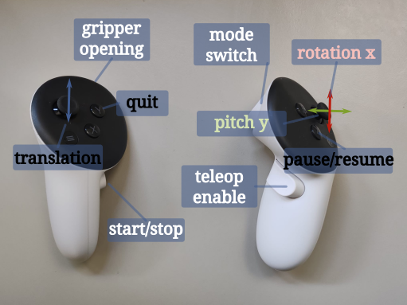

# panda_teleop_docker

# How-To:

0. Clone the repo:

1. Compile the docker:
Make sure you installed docker dev extension in your vscode server.
ctrl + shift + p -> type "Rebuild and reopen in container"

This will take a lot time.
Afterwards, the vscode will open inside the container.

2. Copy the tasks:
Copy the tasks to the .vscode in your current folder, so that you can start the robot/gripper/vpn/recording scripts:
ctrl + shift + p -> type "Run Tasks"
If you configure correctly, you will see the three tasks: start_robot, start_gripper, start_vpn, start_recording.
Then you should run robot,gripper and vpn first. Then the recording scripts.

If you don't see the tasks, you can still manually launch all of them as following:

### Start Robot

cd ~/ws/3rd_party_libs/deoxys_control/deoxys
auto_scripts/auto_arm.sh /root/ws/3rd_party_libs/panda_control/config/charmander.yml /root/ws/3rd_party_libs/panda_control/config/control_config.yml

###  Run Gripper
* Start with panda gripper
```
cd ~/ws/3rd_party_libs/deoxys_control/deoxys
auto_scripts/auto_gripper.sh /root/ws/3rd_party_libs/panda_control/config/charmander.yml /root/ws/3rd_party_libs/panda_control/config/control_config.yml
```

Or
* Start with belt gripper
```
cd ~/ws/3rd_party_libs/panda_control/scripts
python3 run_belt_gripper.py
```

### Run VR VPN
To connect the Quest VR with PC via cable. If both are in the same network, this step is not needed.

```
gnirehtet run
```

### Start Recording

* Start teleoperation
```
cd /root/ws/3rd_party_libs/belt_finger_control/scripts
python3 record_counterfactual_dataset_vr_franka_gripper.py
```

## How to use the Quest Controller:

### Basic Usage:


After running the recording scripts, it will show "waiting for vr connection".
Then you need to open the quest, go to browser, refresh the page, click connection and start XR.
Then you may put the quest on your neck (tightly).

The robot will first go to the home position, then you may do the teleoperation.
There are two mode: **master trajectory mode**, and **follow trajectory mode**. 
The swith between these two mode is by click the trigger button of the right controller.

The Master trajectory mode allows you to record a trajectory from the very beginning and saved to the give path.
The follow trajectory mode will first replay the most recently recorded master trajectory. Then, at any time step later, you can take over the control.

1. Move the robot: The right controller is used for pose control. To activate this, you need to grip the "grip button" of the right hand to enable pose tracking.

2. Open the gripper: The left controller "trigger" button is for gripper open and close. It is continuously controlled.

3. Move the belts (only for belt gripper): The joystick of the left and right hand control the belt's general motion.

4. Start master trajectory recording: Make sure you are not currently in master trajectory mode. Click start button (grip button of the left controller). Press the "enable" button on the right controller and teleop. To stop and save the recording, press the "start/stop" button again. The robot will then move back to the default start pose.

5. Start follow trajectory recording: Make sure you already recorded at least one master trajectory. Click the right trigger button switching mode to follow trajectory mode. Then, click start button, which will bring the robot first to the start pose of the most recent recorded master trajectory. After which, the robot will replay the master trajectory. You can take over the control at any time by click the "enable" button and start moving.